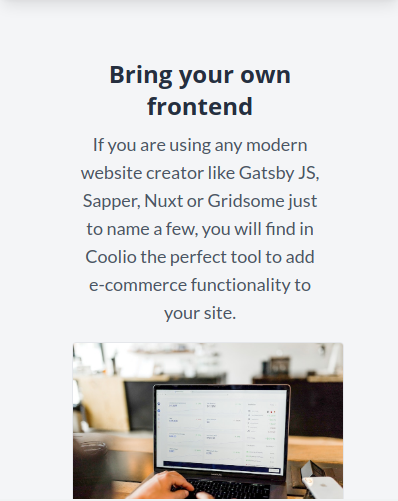

# Coolio (Beta)

Coolio is an e-commerce site.
## Frontend: Svelte
	Svelte Version: 3.0.0
	Svelte is a radical new approach to building user interfaces. Whereas traditional frameworks like React and Vue do the bulk of their work in the browser, Svelte shifts that work into a compile step that happens when you build your app.
## Backend: Ruby on Rails & GraphQL powered backend.
	Ruby version : 3.0.2
	Rails version : 6.1.4
	This language is pretty unique in that it covers both the front- and backend, meaning that as a Ruby on Rails developer you can describe yourself as truly full stack.
It uses JWT for authentication.

With Coolio you can create your own e-commerce site with Gatsby, Sapper, Nuxt, Gridsome... you name it. And because it's Graphql powered it's very easy for you to use only what you need.

Coolio includes an admin example site made with Svelte JS and Apollo client. It uses TailwindCss for layout and styling.

## Screes

## The Road ahead

https://github.com/unudeveloper/Ruby-on-Rails-website-.git

## Credits

Coolio has been developed by [UNU developer](https://www.alvareznavarro.es).

## License

Coolio is licensed under the MIT License.
